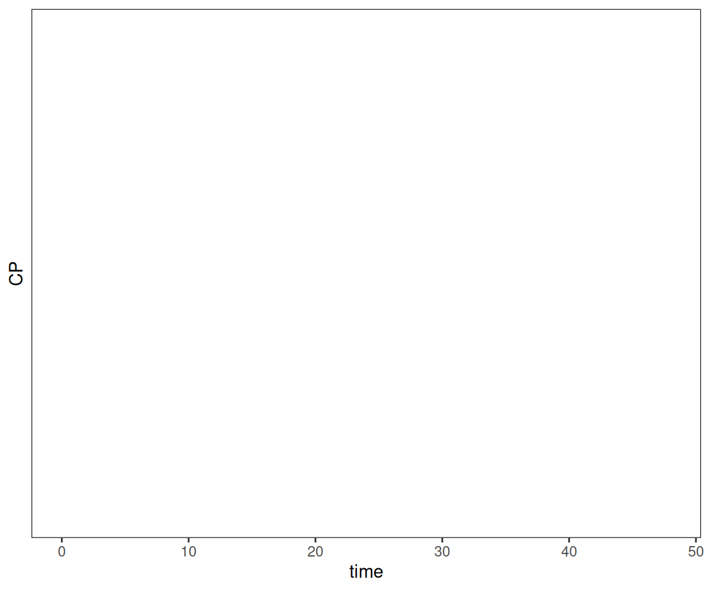
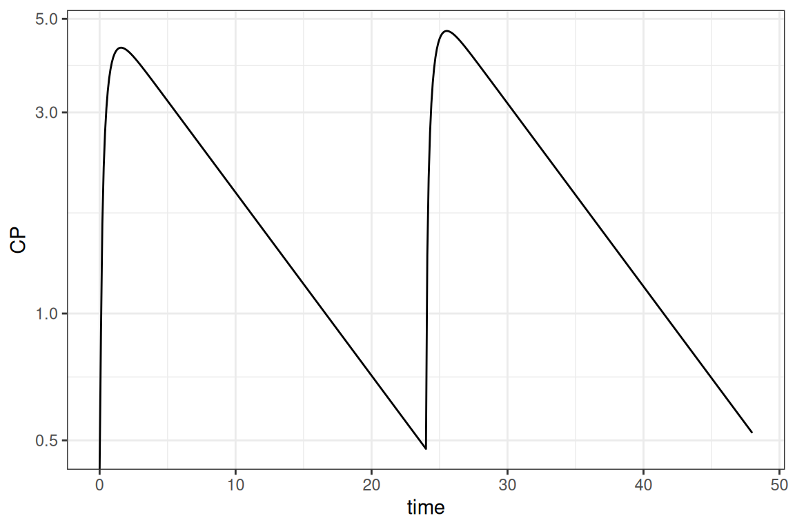
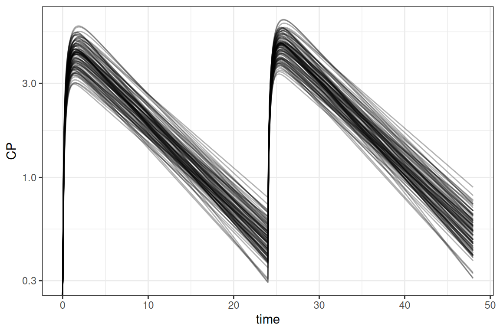
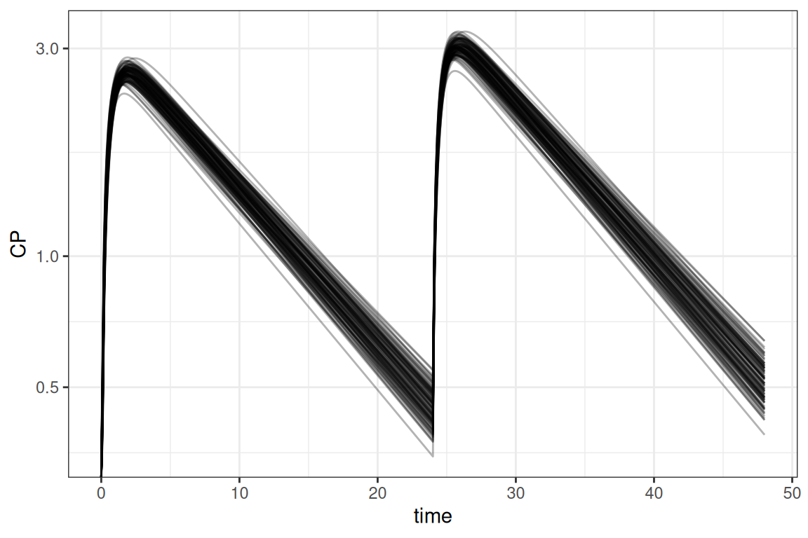
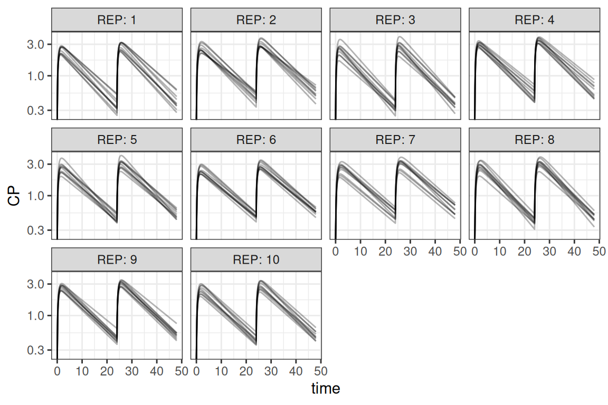
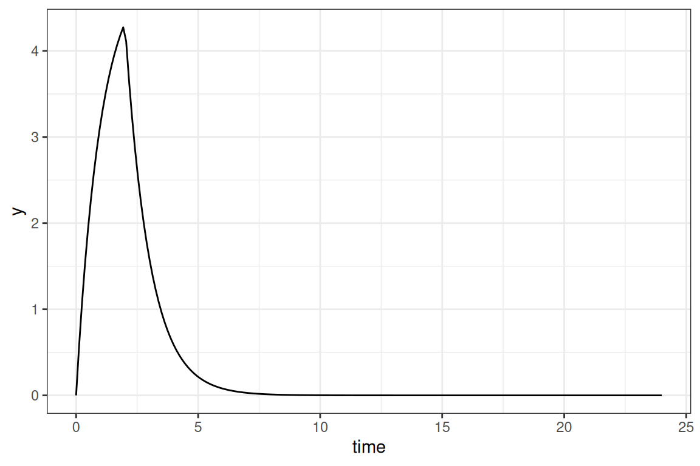

# Simulations using R

## Introduction

This vignette describes how pharmacometric models can be simulated in R
by using the `amp.sim` package. In the field of pharmacometrics, models
are often estimated using the NONMEM software tool. However, simulating
such models is more often done in R. This method is commonly preferred
because an entire exercise can be done in one environment. There might
also be advantages with respect to efficiency (object sizes and speed).

When simulating in R there are different packages available to do so.
Although there are more, the `amp.sim` package support the following
regularly used packages, each having their own pros and cons:

- `deSolve` package: Widely used general solver package. Can be slow
  when models are not compiled and does not have specific features for
  PKPD modeling. For simple models this package can be a good choice
- `rxode2` package: Package specified towards PKPD modeling. Simulations
  are fast and is the backbone for the estimation package `nlmixr2`. For
  models that are estimated and simulated solely in R this can be a good
  choice
- `nlmixr2` package: This is is a similar method as the previous,
  however the syntax is created using the `nonmem2rx` package. This will
  create a model not only suitable for simulations but also directly for
  estimation using the `nlmixr2` package.
- `mrgsolve` package: Package specified towards PKPD model. Simulations
  are also fast. Syntax for models is highly comparable to NONMEM
  syntax. When comparing with NONMEM syntax this can be good choice

This vignette highlights how the different packages can be used and
provide some examples for different type of simulations.

## Model translation

A main feature of the package is the translation of NONMEM models to one
of the frameworks discussed above. Within this translation step, the
model itself is translated and a starting point for controlling the
simulations is provided. To perform the translation, the
`convert_nonmem` function can be used. This function will translate the
model as good as possible and create all applicable code to perform an
initial simulation:

``` r
library(amp.sim)
convert_nonmem("run1.mod", "example1", type_return = "deSolve")
# convert_nonmem("run1.mod", "example2", type_return = "rxode2")
# For rxode2/nlmixr2 it is advised to let the nonmem2rx package
# do the translation, added value is that the model can also be use for fitting! 
convert_nonmem("run1.mod", "example2", type_return = "nonmem2rx")
convert_nonmem("run1.mod", "example3", type_return = "mrgsolve")
```

When the function is called, by default a file including the model will
be generated (e.g. example1.r) and a separate file to control the
simulation (e.g. example1_control.r). The control file can usually be
directly submitted in R to perform a simple simulation and plot the
result. In case final estimates from a NONMEM run should be used for the
simulations, a NONMEM ext file can be provided to the function.

Be aware that the function tries to translate a NONMEM model as good as
possible. There might however be cases that manual adaptations are
necessary, simply because they are not supported by the package that
performs the simulation. Depending on the package being used for
simulation, the following items might need additional attention:

- Handling of (time-varying) covariates
- Usage lag time and bio-availability (mainly applicable for deSolve)
- Handling of mixture models
- Handling of inter-occasion variability
- Handling of NONMEM reserved keywords or syntax

For more information on this see [Considerations for translating
models](https://leidenadvancedpkpd.github.io/amp.sim/articles/04.options_restrictions.md).

## Simulation of typical subject

For the remainder of the vignette, a translation to an `mrgsolve` model
is used. The main principles however holds for the other packages as
well. The step below shows the original model and the result of the
translated model:

``` fortranfree
;; Importance: 0
;; Description: 1 CMT PK model with oral absorption
$PROB  1 CMT PK model with oral absorption
$INPUT
STUDYID ID TRT CMT AMT TIME TAFD TALD DV EVID MDV CNTRY SEX AGE WEIGHT HEIGHT BMI FLAGPK STIME
$DATA NM.theoph.02B.csv IGNORE=@
$SUBROUTINES  ADVAN6 TOL=3
$MODEL
COMP = (ABS)
COMP = (CENTRAL)

$PK
COV1 = (WEIGHT/70)**THETA(4)
KA = THETA(1) * COV1 * EXP(ETA(1))
CL = THETA(2) * EXP(ETA(2))
V  = THETA(3)
S2  = V
K20 = CL/V
F1  = 1

$DES
CP = A(2)/V
DADT(1) = - KA*A(1)
DADT(2) =   KA*A(1) - K20*A(2)

$THETA
(0,.1)  ; KA (1/h)
(0,2)    ; CL (l/h)
(0,1)    ; V (l)
0.2      ; effect of WT

$OMEGA
.01 ; ETA KA
.02 ; ETA CL

$ERROR
Y = F * (1 + EPS(1))
IPRED = F

$SIGMA
.1 ; Prop. error

$EST METHOD=1 INTERACTION MAXEVAL=9999  PRINT=5 NOABORT POSTHOC
$COV COMP
$TABLE  ID TIME ETA1 ETA2 KA CP NOPRINT ONEHEADER FILE=par
```

``` r
library(amp.sim)
convert_nonmem(system.file("example_models/PK.1CMT.ORAL.COV.mod",package = "amp.sim"), 
               "example", type_return = "mrgsolve", mod_return = "CP")
```

``` cpp
$PLUGIN autodec nm-vars Rcpp
$PROB 1 CMT PK model with oral absorption

$PARAM
THETA1 = 0.1, THETA2 = 2, THETA3 = 1, THETA4 = 0.2, WEIGHT = -999

$CMT
A1 A2

$PK

COV1 = pow((WEIGHT/70), THETA(4)) ;
 KA =  THETA(1) * COV1 * exp(ETA(1)) ;
 CL =  THETA(2) * exp(ETA(2)) ;
 V =  THETA(3) ;
 S2 =  V ;
 K20 =  CL/V ;
 F1 =  1 ;

A_0(1) = 0;
A_0(2) = 0;

$DES

 CP =  A(2)/V ;
 DADT(1) =  - KA*A(1) ;
 DADT(2) =    KA*A(1) - K20*A(2) ;


$OMEGA @block
0.01 
0 0.02

$SIGMA @block
0.1

$ERROR
F = A(2)/S2;

 Y =  F * (1 + EPS(1)) ;
 IPRED =  F ;


$CAPTURE CP
```

When we run the control script (without adaptations) and plot the
results:

    Warning in scale_y_log10(): log-10 transformation introduced infinite values.

    Warning: Removed 4800 rows containing missing values or values outside the scale range
    (`geom_line()`).



We see that in this case, that the simulations are empty. This is
because the model has a covariate of weight. Because the translation
does not take into account the dataset, the package cannot set a valid
value and is therefore set to -999. Below we can see the simple addition
to get a result. Other adaptations showcased are, simulate a single
subject without random effects (using `zer0_re`):

``` r
library(ggplot2)
parm <- c(WEIGHT = 70)               
mod  <- param(mod,parm)   
out  <- zero_re(mod) |> ev(evnt) |> mrgsim(end = 48, delta = 0.1, nid=1)
ggplot(out@data,aes(time,CP)) + geom_line() + scale_y_log10() + theme_bw()
```



**Take into account that in the result above the initial estimates from
the model are used. We could provide the ext file to use final
estimates**

## Simulation of population

In most cases the simulation should be performed for more than 1
subject. There is some variation what the different subjects represent.
It could be either inter-individual variability (IIV), uncertainty or a
combination of both. This section shows how various combinations can be
handled.

### Simulations including only IIV

The situation where you want to simulate with only IIV, is the easiest
and is already integrated within the `mrgsolve` package. By default,
when a NONMEM model is translated, the model matrices included in the
model. This is also used by the `mrgsim` function to sample $\eta$
values for the model. As shown in the first example the original code
was adapted to set IIV to 0. If we do not do this and set a number of
individuals to simulate we can easily include IIV

``` r
parm <- c(WEIGHT = 70)               
mod  <- param(mod,parm)   
out  <- mod |> ev(evnt) |> mrgsim(end = 48, delta = 0.1, nid=100)
ggplot(out@data,aes(time,CP, group=ID)) + geom_line(alpha=0.3) + 
  scale_y_log10() + theme_bw()
```



#### Simulations including only uncertainty

In case we only want to simulate with uncertainty, we need to disregard
IIV in the same way as in the first example. Furthermore we need to
sample $\theta$ values from the covariance matrix for the uncertainty.
The `amp.sim` package provides a function to do so (`sample_par`). Once
we have the sampled parameters, it is a matter to simulate each row of
the data frame with the sampled parameters. In this example the `dplyr`
package is used to accomplish this:

``` r
library(dplyr)
parm  <- c(WEIGHT = 70)
mod   <- param(mod,parm)   

# sample from uncertainty and apply simulations
extf  <- system.file("example_models/PK.1CMT.ORAL.COV.ext",package = "amp.sim")
covf  <- system.file("example_models/PK.1CMT.ORAL.COV.cov",package = "amp.sim")
parms <- sample_par(ext = extf, covmat = covf, nrepl = 100, uncert = TRUE) |> 
  rename_with(~ sub("S", "", .x))

dosim <- function(df){
  zero_re(mod) |> ev(evnt) |>
    param(c(unlist(df),parm)) |> 
    mrgsim_df(end = 48, delta = 0.1, nid=1) |>
    mutate(ID = unique(df$ID))  
}

out <- parms |> group_by(ID) |>
  group_map(~dosim(.x),.keep=TRUE) |> bind_rows()

ggplot(out,aes(time,CP,group=ID)) + geom_line(alpha=.3) + 
  scale_y_log10() + theme_bw()
```



#### Simulations including IIV and uncertainty

For larger clinical trial simulations it is often necessary to simulate
including both IIV and uncertainty. This section describes a way to do
so. Also running these types of simulation can be computationally
intensive. To speed up the simulation an example is included that uses
the `parallel` package, although various other frameworks could be used
to multi-thread the simulations. This example combines the examples
above where in this case 10 trials are simulated for 10 subjects each

``` r
parm  <- c(WEIGHT = 70)
extf  <- system.file("example_models/PK.1CMT.ORAL.COV.ext",package = "amp.sim")
covf  <- system.file("example_models/PK.1CMT.ORAL.COV.cov",package = "amp.sim")

parms <- sample_par(ext = extf, covmat = covf, nrepl=10, uncert=TRUE)
parms <- setNames(parms,sub("S","",names(parms)))

library(parallel)
cl  <- makeCluster(getOption("cl.cores", 7))
clusterExport(cl, c("evnt","parms","mod","parm"))
out <- parLapply(cl, 1:nrow(parms),function(x){
  library(mrgsolve)
  ret     <- mod |> ev(evnt) |> param(c(unlist(parms[x,]),parm)) |>
               mrgsim_df(end = 48, delta = 0.1, nid=10)
  ret$REP <- unique(parms$ID[x])
  ret
})
stopCluster(cl)

out <- do.call(rbind,out)
ggplot(out,aes(time,CP,group=ID)) + geom_line(alpha=.3) + 
  scale_y_log10() + facet_wrap("REP",labeller = "label_both") + 
  theme_bw()
```



For running in parallel, the following steps are important:

1.  Create a cluster object where the numbers of cores are specified
    (`makeCluster`)
2.  Exporting of objects to the cluster, so each worker has access to
    all objects used in the calculations (`clusterExport`)
3.  Performing a special kind of lapply for parallel processing
    (`parLapply`)
4.  Let R know that the cluster calculations are done (`stopCluster`)

It is some extra work to set-up a ‘parallel’ script, but this can really
pay-off with drastically decreasing run-times.

Within the examples above, weight is kept constant for simplicity.
Obtaining valid covariates can be handled in different ways. There are
different ways of sampling values and provide this to the simulation
functions. Please refer to the help pages of the different packages for
additional guidance.

In the example above, the $\eta$ values are sampled within the model. It
is also possible to perform all sampling within R using the `sample_par`
function. In case a clinical trial simulation should be done using a
combination of replicates and subjects, it is more convenient to use the
`sample_sim` function instead. This function is a wrapper around
`sample_par` but makes it easier to make a combined sampling dataset of
replicates and subjects.

### Using a template model

In case a closed form model should be simulated, the previous mentioned
methods do not work. For these cases different template models are
present in the `amp.sim` package. It includes 1 and 2 compartment models
for IV, infusion and extra-vascular dosing, parameterized using rate
constants or CL/V, and as analytical solution or differential equations.
The `tmpl_model` function can be used without arguments to see what is
available:

``` r
tmpl_model()
```

     [1] "ana1CMTbolusC.tmp" "ana1CMTbolusK.tmp" "ana1CMTivC.tmp"
     [4] "ana1CMTivK.tmp"    "ana1CMToralC.tmp"  "ana1CMToralK.tmp"
     [7] "ana2CMTbolusC.tmp" "ana2CMTbolusK.tmp" "ana2CMTivC.tmp"
    [10] "ana2CMTivK.tmp"    "ana2CMToralC.tmp"  "ana2CMToralK.tmp"
    [13] "des1CMTbolusC.tmp" "des1CMTbolusK.tmp" "des1CMTivC.tmp"
    [16] "des1CMTivK.tmp"    "des1CMToralC.tmp"  "des1CMToralK.tmp"
    [19] "des2CMTbolusC.tmp" "des2CMTbolusK.tmp" "des2CMTivC.tmp"
    [22] "des2CMTivK.tmp"    "des2CMToralC.tmp"  "des2CMToralK.tmp" 

A model can be provided to the function, in which case the simulation
code can be added in the current script right after the function call
(when working in Rstudio), within the console or as a string:

``` r
tmpl_model("ana1CMTivC.tmp")
```

When submitting the lines of code you will directly get an initial
simulated curve:

``` r
library(ggplot2)
ana1CMTiv <- function(Dose,pars,t,dur){
  C <- 1/pars['V']
  L <- pars['CL']/pars['V']
  ifelse(t <= dur,
    (Dose/dur) * C / L * (1-exp(-L * t)),
    (Dose/dur) * C / L * (1-exp(-L * dur)) * exp(-L * (t-dur))
  )
}
pars   <- c(CL=1,V=1)
times  <- seq(0,24,length.out=200)
out    <- mdose(Dose = 10, tau = 24, ndose = 1, t = times,
                func = ana1CMTiv, pars = pars, dur = 2)
ggplot(out,aes(time,y)) + geom_line() + theme_bw()
```



This method can be a lot faster for models with an analytical solution,
though simulating multiple doses is a bit more of a hassle. For these
situations the `mdose` helper function can be used to perform
superposition. Finally, a simple example is shown how these models can
be rewritten for simulating a population:

``` r
samp <- data.frame(CL=rnorm(100,10,1),V=rnorm(100,5,0.5))
out <- lapply(1:nrow(samp), function(x){
  data.frame(mdose(Dose=10,tau=24,ndose=1,t=times,func=ana1CMTiv,
                   pars=unlist(samp[x,]),dur=2),ID=x)
})
out <- do.call(rbind,out)
```

### Final thoughts

Simulating entirely in R can be quite some work. The `amp.sim` can help
in reducing the amount of work to rewrite everything to R, and makes it
easier to perform a simple simulation. Because R is different from
NONMEM there are important things to take into account. When the
simulations become larger it can also become more difficult to perform
the simulation in R and the run-times can get out of hand. But the usage
of template models (mainly the ones with an analytical solution) and the
`parallel` package can help in optimizing performance.
