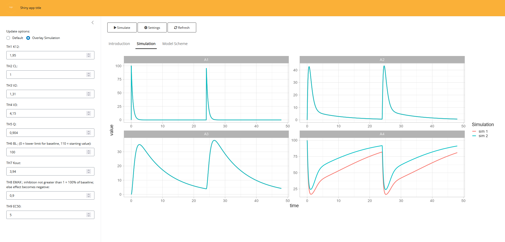

## Introduction

Shiny apps are a great way of visualizing a (translated) model. The main advantage of a shiny app for a simulation model is that you can easily test the effect of different parameters on the outcome of a simulation. When translating a model using the `amp.sim` package you will have a standardized way models are created. This makes it possible to automatically create a shiny app for such a model.

## Basics

To create a shiny app for a model, you will need a translated model and a single function call:

```{r eval=FALSE}
library(amp.sim)
mod2shiny(parvector = c(THETA1=0.1,THETA2=0.3),
          modfile   = 'model.cpp',
          evnt      = ev(amt = 100, ii = 24, addl = 1),
          naming    = c(THETA1 = "KA (1/h)", THETA2 = "CL (l/h)"),
          framework = "mrgsolve"
          outloc    = "simApp")
```

The most important parameters for the function are:

- parvector: vector with the parameter values used in the model with the initial values to set in the app
- modfile: The translate model available in a separate file
- evnt: The events that should be used for the simulations. The app uses default dosing provided here, manual adaptations to the app for this are possible afterwards
- naming: by default the names from the parvector argument are used, when naming is provided more sensible names for parameters can be provided
- framework: because of differences between the simulation packages, the framework in which the modfile is created should be provided here
- outloc: File path where the resulting app files should be written to

Once the function is called, the appropriate app files are created (e.g. ui.r/server.r and directories to store app files).
Instructions are shown on the screen how you can directly run the shiny app, which is basically just a call to `shiny::runApp`.

## App appearance

When the app is created an app will be created that will look somehting like:

<!-- ```{r echo=FALSE, out.width="100%"} -->
```{r echo=FALSE, out.width="100%"}
#
#knitr::include_graphics(paste0(getwd(),"/shinyscreenshot.PNG"))
knitr::include_graphics(file.path("..","man", "figures", "shinyscreenshot.PNG"))
```
<!--  -->

The app is basic but already has some features build into it:

- Overlaying; When looking at the outcome of different parameter values you often want to compare different simulations. For this reason there is an option to overlay simulations. This way you can directly compare what would happen if you simulate with different settings
- settings; When overlaying simulations it can become difficult to see what the different settings were for the various simulations. The app provide a way to see what the different settings were for the various simulations
- Refreshing; although an entire shiny app can be refreshed manually, this option will only reset the parameter values to their original values.
- General customization; The app will contain placeholders that you can use to make the app more usable. There is a tab available where you can provide information for the user and where a model scheme can be added as background information

## Manual adaptations

Once the app is created you can directly use it for simple type of simulations. However in many cases you would want to make manual adaptations the app. Because the `mod2shiny` function creates the applicable app files, it is very easy to make manual adaptations to these files.
In the chunk below we can see how we can implement different dose heights by adjusting only two lines of code:

```{r eval=FALSE}
# part added in ui.r
numericInput(inputId = 'DOSE', label='Dose (mg):', value=100)
# part added in server.r
events <- ev(amt = input$DOSE, ii = 24, addl = 1)
```

To add information regarding the app, you can adapt the ui.r file and adapt the part that reads "Placeholder for ...".
Finally, you can add your own logo to the app either by providing this as an argument to `mod2shiny` or by replacing the file in the www directory (using the same name). This can also be done for the model scheme, just replace the file in this directory with a same named file.
In case you want to create a more complex app, this method can be used to create an initial starting point.
